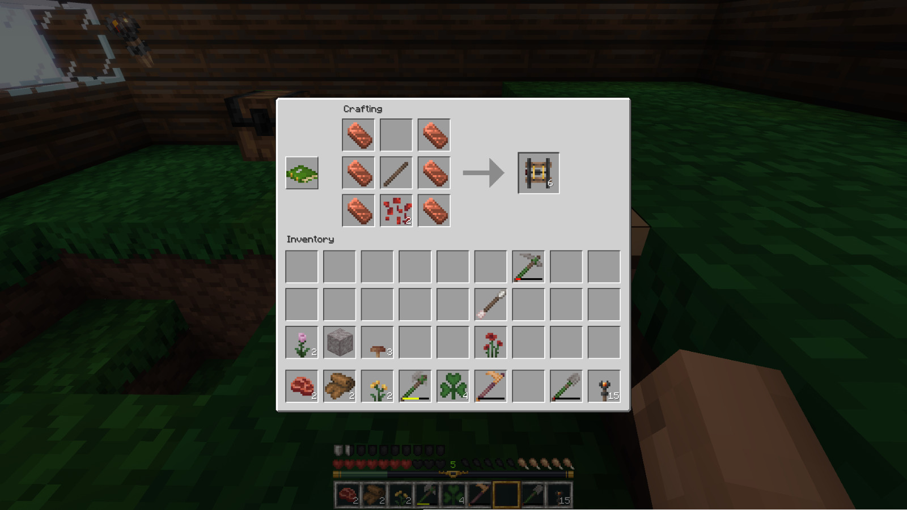

# Copper Rails



Adds crafting recipes for rails using copper ingots instead of iron or gold.
Tested with VoxeLibre 0.91.2 on Luanti 5.15, should work with Mineclonia too.

## Crafting Recipes

### Copper Rail (16)

```
C   C
C S C
C   C
```

- C = Copper Ingot
- S = Stick

### Copper Powered Rail (6)

```
C   C
C S C
C R C
```

- C = Copper Ingot
- S = Stick
- R = Redstone Dust

## LICENSE

[The MIT License](./LICENSE).
